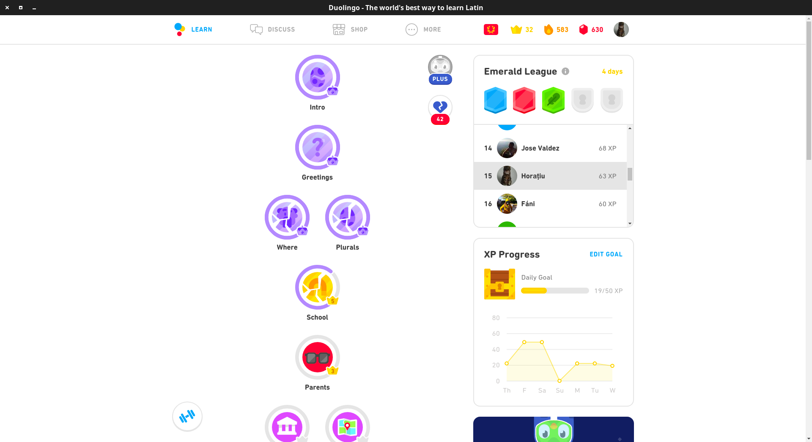

[](https://hmlendea.go.ro/funding)
[](https://github.com/hmlendea/dl-desktop/releases/latest)
[](https://github.com/hmlendea/dl-desktop/actions/workflows/node.js.yml)
[](https://gnu.org/licenses/gpl-3.0)

# Duolingo Desktop

An unofficial Linux desktop application for Duolingo that wraps the official web application in a dedicated Electron window and blocks common trackers.



## 📑 Table of Contents

- [Capabilities](#capabilities)
- [Usage](#usage)
- [Known Limitations](#known-limitations)
- [System Requirements](#system-requirements)
- [Installation](#installation)
  - [CLI Installation](#cli-installation)
  - [Manual Installation](#manual-installation)
- [Development](#development)
  - [Requirements](#requirements)
  - [Setup](#setup)
  - [Build](#build)
  - [Run](#run)
- [Contributing](#contributing)
- [Acknowledgements](#acknowledgements)
- [Security](#security)
- [Supporting the Project](#supporting-the-project)
- [License](#license)

## ✨ Capabilities

- Opens Duolingo in a standalone desktop window.
- Removes common tracking query parameters from requests.
- Blocks a small set of advertising, telemetry, and attribution domains.
- Sends Do Not Track and Global Privacy Control headers by default.

## 🚀 Usage

After installation, launch the application from your desktop menu. If you prefer to start it from a terminal, run:

```bash
dl-desktop
```

The application opens Duolingo directly and applies the built-in privacy filters automatically.

## ⚠️ Known Limitations

- This is an unofficial client and depends on Duolingo's web application.
- Only the FlatHub package is officially supported in this repository.
- The AUR and Snap packages are community-maintained.
- Behaviour can change if Duolingo updates its web application.

## 🖥️ System Requirements

- **OS:** Linux
- **RAM:** 2 GB
- **Network:** An active internet connection
- **Desktop:** A graphical desktop environment capable of running Electron applications

## 📦 Installation

[](https://flathub.org/apps/details/ro.go.hmlendea.DL-Desktop)
[](https://snapcraft.io/duolingo-desktop)
[](https://aur.archlinux.org/packages/duolingo-desktop-bin/)
[](https://github.com/hmlendea/dl-desktop/releases)

The FlatHub package is the only distribution channel that is officially supported by this repository. The AUR and Snap packages are maintained by the community.

### CLI Installation

To install the FlatHub package:

```bash
flatpak install flathub ro.go.hmlendea.DL-Desktop
```

To install the Snap package:

```bash
snap install duolingo-desktop
```

On Arch Linux, install the AUR package with your preferred helper:

```bash
paru -S duolingo-desktop-bin
```

or, if you use `yay`:

```bash
yay -S duolingo-desktop-bin
```

### Manual Installation

Download the latest GitHub release, extract it, and run the packaged binary on a supported Linux system.

## 🛠️ Development

### Requirements

- [Node.js 24.x](https://nodejs.org/)
- npm

### Setup

```bash
npm install
```

### Build

```bash
npm run build
```

### Run

```bash
npm start
```

## 🤝 Contributing

You are welcome to submit any suggestion, feedback, or modification to this project.

When doing so, please:
- Maintain cross-platform compatibility
- Maintain the pull requests as focused and consistent with the existing code style
- Maintain your branch up-to-date with `master`
- Revise the documentation when behaviour changes
- Properly test all changes

## 🙏 Acknowledgements

- Duolingo, for the language-learning platform this application wraps.
- [creepertron95](https://github.com/creepertron95) for the icon artwork used by the application.
- All contributors who have helped maintain the project.

## 🔒 Security

For information on reporting security vulnerabilities, see [SECURITY.md](./SECURITY.md).

## 💖 Supporting the Project

Discovered a problem or have a suggestion? [Open an issue](https://github.com/hmlendea/dl-desktop/issues)!

If you find this project useful, consider [funding it](https://hmlendea.go.ro/funding) or starring ⭐️ it on GitHub!

[](https://hmlendea.go.ro/funding)

## 📄 License

This project is being distributed under the GNU General Public License v3.0 or later.
See [LICENSE](./LICENSE) for further information.
